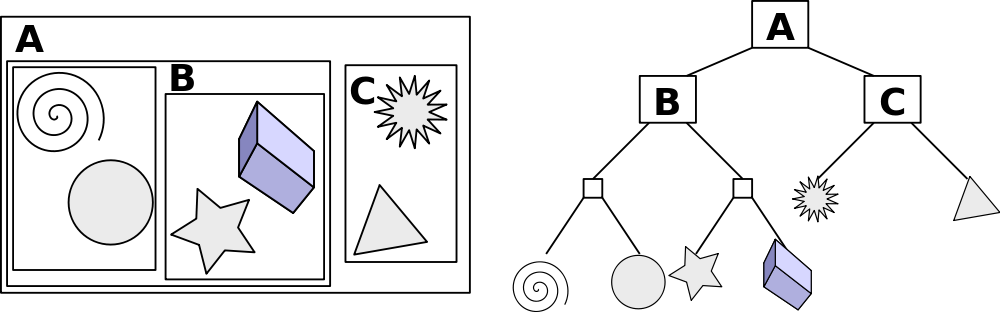
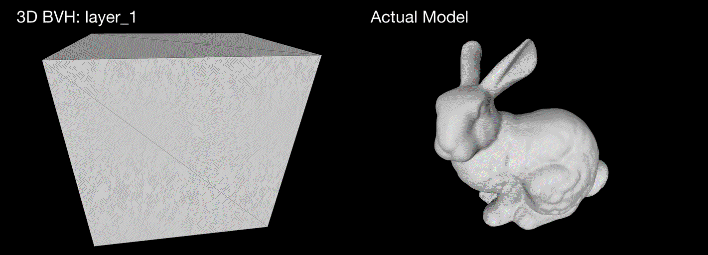
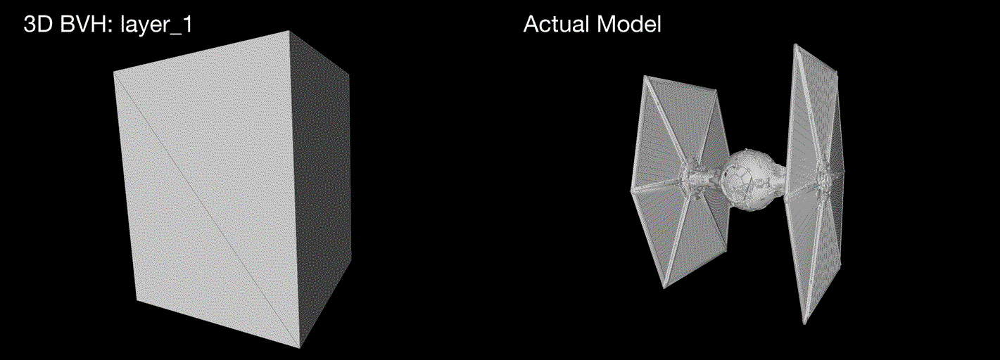

# BVH: Bounding Volume Hierarchy
A implementation of BVH, which is a tree of boxes where each node encloses all of its descendants. This structure can accelerate some computer graphics technique such as path-tracing.  
  
[Note]  
I created a tree structure by using the mid point of the largest axis. Sort the bounding box centroids in the largest axis direction. Then split into a leftand arightside


<div align="center">
  
    <p>
    Fig1. An example of a bounding volume hierarchy using rectangles as bounding volumes.
    </p>
  
    <p>
    Fig2. Bunny
    </p>
  
    <p>
    Fig3. tie-fighter
    </p>  


</div>

## Environment
Ubuntu 18.04  
Python3.6(Anaconda3-5.2.0)


## Usage
```
python main.py argvs[1] argvs[2]


argvs[1]  :  path to input mesh(only .obj tri mesh) 
argvs[2]  :  path to output dir  

Note:
Default minimum number of triangles for each bvh is 64. 
If you want to change, see around line 56 in "./bvh/BVH.py".


```

## References

[1] [Scratchapixel 2.0](https://www.scratchapixel.com/lessons/advanced-rendering/introduction-acceleration-structure/bounding-volume-hierarchy-BVH-part1). "Volume 2: Better, Faster, More (2017), Introduction to Acceleration Structures"
[2] [EDAN30 - Photorealistic Computer Graphics](http://fileadmin.cs.lth.se/cs/Education/EDAN30/lectures/S2-bvh.pdf)

